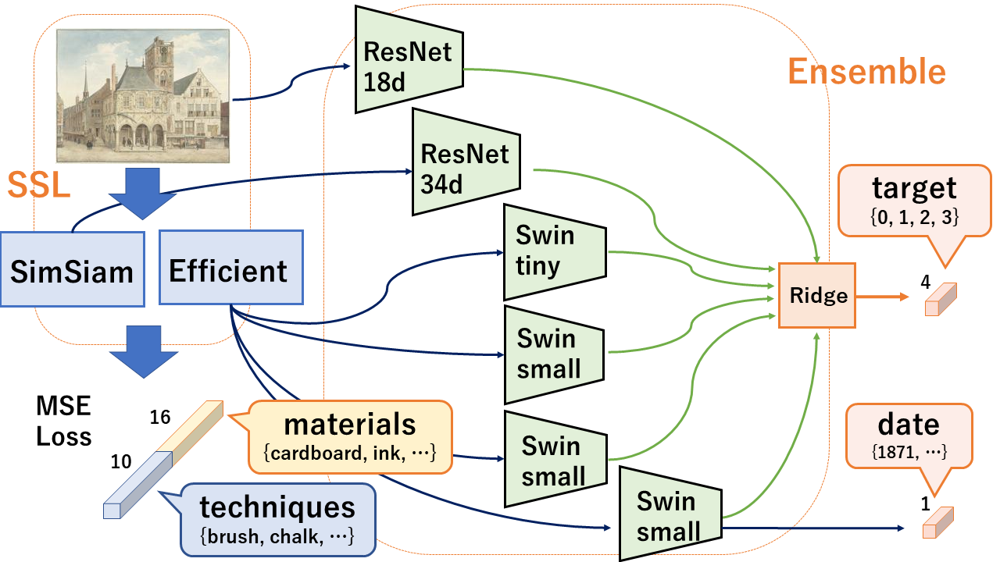

# atmaCup11
atmCup11プログラム共有用

テーマ：「美術作品の画像やメタデータからその作品がどの時代に作成されたのかを予測する」

## Result
・CV = 0.6590
・Public  Score = 0.6674
・Private Score = 0.6631

 
## DataSet
 ・Image：
  　- num：9856
    - widge, height：75〜225, 75〜225
    - channel：3
 ・Labels：
    - object_id (str)：作品に一意につけられたID
    - sorting_date (int)：作品の代表年 (西暦) 
    - art_series_id (str)：シリーズ物の作品に対してユニークなID
    - target (choice([0,1,2,3]))：作品の年代カテゴリ, 予測対象
 ・DataArgumentation：CosineAnnealingWarmRestarts (Ranger)
 
## Network
1. 事前学習 (SimSiam & ESViT)
 - ともにmaterials + techniquesのマルチラベルをMSE Lossにより学習
 
2. アンサンブル学習
 -  targetの予測（ResNet18d, ResNet34d, Swin_tiny, Swin_small）
 -  sorting_dateの予測 (Swin_small)
 

CV vs LB
|exp|CV|LB|notes|
|:-|:-|:-|:-|
|0|1.3993|| 予測にsigmoidがかかっているバグ、debug=Trueになってる|
|1 |1.1402  |  |exp000のバグを直した  |
|2 |2.9  |  |SGDつかってみた、ダメダメだった  |
|3 |0.9069  | 0.8863 |ssl(SimSiam)を使ってみた、効果あり  |
|4 |0.968  |  |simsiam, materialsを使ってpretrain、materialsをつかって  |
|5 |0.9693  |  |materialsを使ってpretrain、(sslは使ってない)、pretrainはあまり効果ない？  |
| 6|  |  |materialsとtechniquesの両方をBCEでpretrain、(sslはなし)  |
| |  |  |  |
| |  |  |  |
| |  |  |  |
| |  |  |  |
| |  |  |  |

